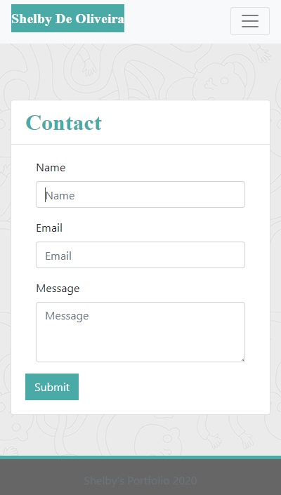

# Responsive Portfolio

## Description 

This is my portfolio site. It currently uses html, bootstrap and some minor css. The site is configured to be mobile friendly.

Future upgrades include:
* Implementing javascript for [contact.html](contact.html) to allow people to contact me through email.
* Adding pictures to my projects in my [portfolio.html](portfolio.html).

## Installation

To view locally:
1. Clone the repository.
2. Open [index.html](index.html).

To implement changes:
1. Clone or fork the repository.
2. Open the folder with your preferred IDE.
3. Implement your changes.

## Usage 

To view this site live [click here.](https://shelb-doc.github.io/responsive-portfolio/)

To view this locally, clone the repository, and open [index.html](index.html) with your browser of choice.

## Mobile vs. Desktop
Here we have some screenshots to showcase a comparison of my site in different aspect ratios:

### [index.html](index.html)

#### 400px

  

#### 768px

  

#### 998px

  

### [contact.html](contact.html)

#### 400px

  

#### 768px

  

#### 998px

  

### [portfolio.html](portfolio.html)

#### 400px

  

#### 768px

  

#### 998px

  

## Credits

Thank you to my cat Mimikyu for being my Rubber Ducky.

Thank you to my Testers
* Leo De Oliveira Dias

## License

Licensed under the [MIT](LICENSE.txt) license.